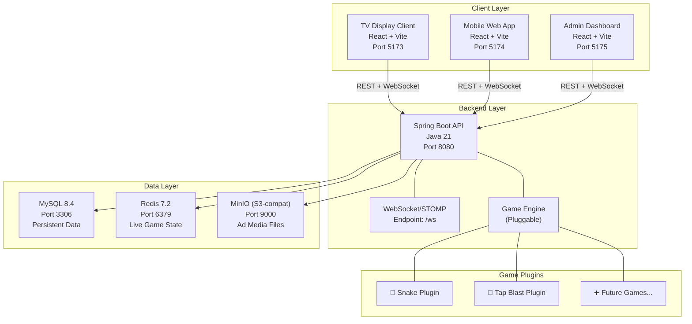
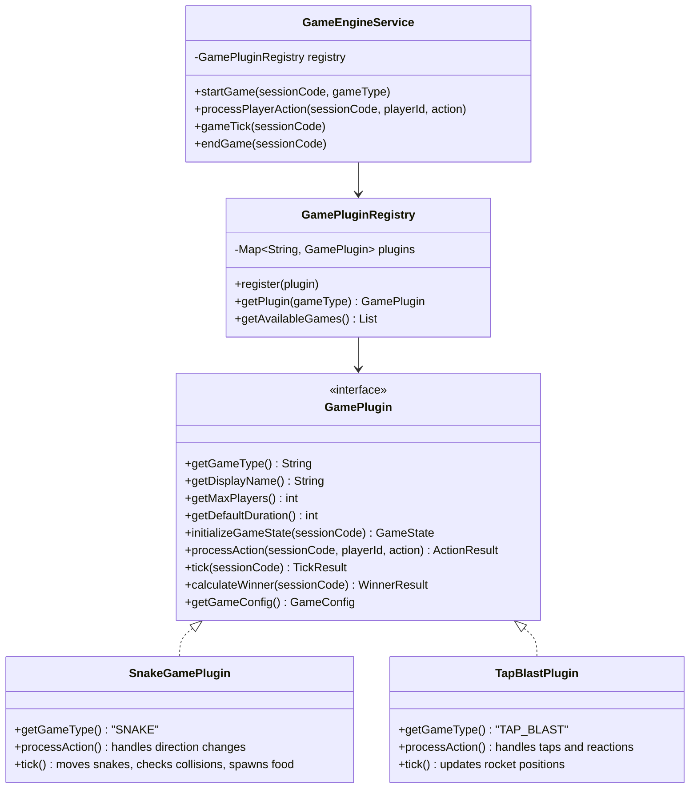
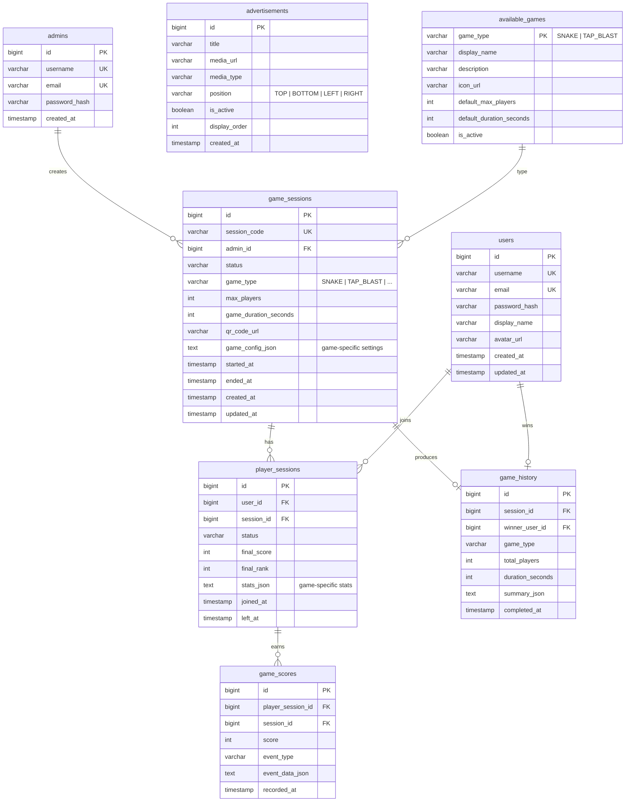
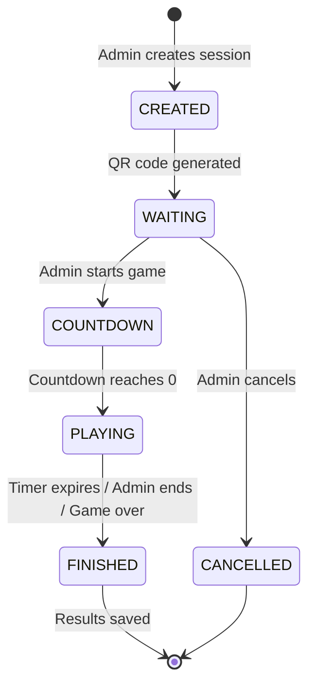

# Smart Interactive Advertising & Gaming Platform — Implementation Plan

## Overview

Build a fully functional **proof-of-concept** platform where an administrator creates a game session, a TV/display shows advertisements and a QR code, users scan the QR code on their mobile phones, join a real-time game through a web browser, play using their mobile devices as controllers, and see live scores, rankings, and winner announcements — all while advertisements rotate around the game area.

### Pluggable Multi-Game Engine

The platform features a **pluggable game architecture** — games are modular plugins that can be added without modifying core platform code. The admin selects which game to play when creating a session.

### Included Games

#### 🐍 Game 1: Snake Game (Primary)
- **TV** shows a shared arena with all players' snakes, food items, and obstacles
- **Mobile** acts as a directional controller (swipe or D-pad: UP/DOWN/LEFT/RIGHT)
- Snakes grow when eating food, players die on collision (wall, self, or other snake)
- Last snake standing wins (or highest score when timer expires)
- Competitive multiplayer — all snakes visible on the TV in real time

#### 🚀 Game 2: Tap Blast Race
- **TV** shows rockets on a launchpad, one per player
- **Mobile** shows a big TAP button — players mash to fill their rocket's launch bar
- Random **GREEN ("BOOST!")** and **RED ("TRAP!")** reaction flashes
- First rocket to finish line wins

#### ➕ Adding New Games
Adding a new game requires only:
1. **Backend**: Implement the `GamePlugin` interface (process actions, calculate scores, determine winner)
2. **Frontend TV**: Create a game visualization component
3. **Frontend Mobile**: Create a game controller component
4. **Register**: Add the game to the plugin registry

No changes to session management, authentication, WebSocket routing, leaderboard, or advertisements needed.

---

## User Review Required

> [!IMPORTANT]
> **AWS S3**: The demo uses **MinIO** (S3-compatible) in Docker to avoid requiring real AWS credentials. Code uses the AWS S3 SDK so switching to real S3 is a config change. Is this acceptable?

> [!IMPORTANT]
> **TypeScript vs JavaScript**: I'll use **JavaScript** to match your original spec and keep the POC simpler. Confirm?

> [!IMPORTANT]
> **Monorepo**: Using **pnpm monorepo** with shared packages (api-client, websocket, types) for the 3 React apps. This avoids code duplication across TV/Mobile/Admin apps. Confirm?

---

## Architecture

### System Architecture Diagram



### Pluggable Game Engine Architecture



### Architecture Principles
- Backend is the single source of truth
- Clients never own business state
- Business logic resides only in the backend
- WebSocket for real-time synchronization
- Redis for caching and live session state only
- MySQL stores persistent data
- Games are pluggable — core platform is game-agnostic
- Demo architecture evolves into production without major redesign

---

## Project Structure

```
F:\Demo antigravati\
├── backend/                          # Spring Boot Application
│   ├── src/main/java/com/smartad/
│   │   ├── SmartAdApplication.java
│   │   ├── config/
│   │   │   ├── SecurityConfig.java
│   │   │   ├── WebSocketConfig.java
│   │   │   ├── RedisConfig.java
│   │   │   ├── AwsS3Config.java
│   │   │   ├── CorsConfig.java
│   │   │   └── JacksonConfig.java
│   │   ├── security/
│   │   │   ├── JwtTokenProvider.java
│   │   │   ├── JwtAuthFilter.java
│   │   │   └── WebSocketAuthInterceptor.java
│   │   ├── controller/
│   │   │   ├── AuthController.java
│   │   │   ├── SessionController.java
│   │   │   ├── GameController.java
│   │   │   ├── AdvertisementController.java
│   │   │   ├── PlayerController.java
│   │   │   ├── LeaderboardController.java
│   │   │   └── AdminController.java
│   │   ├── websocket/
│   │   │   ├── GameWebSocketController.java
│   │   │   ├── WebSocketEventListener.java
│   │   │   └── StompPrincipal.java
│   │   ├── service/
│   │   │   ├── AuthService.java
│   │   │   ├── UserService.java
│   │   │   ├── SessionService.java
│   │   │   ├── GameEngineService.java
│   │   │   ├── AdvertisementService.java
│   │   │   ├── QrCodeService.java
│   │   │   ├── ScoreService.java
│   │   │   ├── LeaderboardService.java
│   │   │   ├── FileStorageService.java
│   │   │   ├── RedisSessionStateService.java
│   │   │   └── GameHistoryService.java
│   │   ├── game/                     # ← PLUGGABLE GAME ENGINE
│   │   │   ├── GamePlugin.java           # Interface
│   │   │   ├── GamePluginRegistry.java   # Registry
│   │   │   ├── GameState.java            # Base state
│   │   │   ├── ActionResult.java         # Action result
│   │   │   ├── TickResult.java           # Tick result
│   │   │   ├── WinnerResult.java         # Winner result
│   │   │   ├── GameConfig.java           # Game config
│   │   │   ├── snake/                    # 🐍 Snake Game Plugin
│   │   │   │   ├── SnakeGamePlugin.java
│   │   │   │   ├── SnakeGameState.java
│   │   │   │   ├── Snake.java
│   │   │   │   ├── Position.java
│   │   │   │   └── SnakeDirection.java
│   │   │   └── tapblast/                # 🚀 Tap Blast Plugin
│   │   │       ├── TapBlastPlugin.java
│   │   │       ├── TapBlastState.java
│   │   │       └── Rocket.java
│   │   ├── entity/
│   │   │   ├── BaseEntity.java
│   │   │   ├── User.java
│   │   │   ├── Admin.java
│   │   │   ├── GameSession.java
│   │   │   ├── PlayerSession.java
│   │   │   ├── GameScore.java
│   │   │   ├── GameHistory.java
│   │   │   └── Advertisement.java
│   │   ├── repository/
│   │   │   ├── UserRepository.java
│   │   │   ├── AdminRepository.java
│   │   │   ├── GameSessionRepository.java
│   │   │   ├── PlayerSessionRepository.java
│   │   │   ├── GameScoreRepository.java
│   │   │   ├── GameHistoryRepository.java
│   │   │   └── AdvertisementRepository.java
│   │   ├── dto/
│   │   │   ├── request/
│   │   │   │   ├── LoginRequest.java
│   │   │   │   ├── RegisterRequest.java
│   │   │   │   ├── CreateSessionRequest.java
│   │   │   │   ├── PlayerActionRequest.java
│   │   │   │   └── UploadAdRequest.java
│   │   │   ├── response/
│   │   │   │   ├── AuthResponse.java
│   │   │   │   ├── SessionResponse.java
│   │   │   │   ├── PlayerResponse.java
│   │   │   │   ├── LeaderboardResponse.java
│   │   │   │   ├── GameStateResponse.java
│   │   │   │   ├── AdvertisementResponse.java
│   │   │   │   ├── GameListResponse.java
│   │   │   │   └── ApiResponse.java
│   │   │   └── websocket/
│   │   │       ├── PlayerJoinMessage.java
│   │   │       ├── PlayerActionMessage.java
│   │   │       ├── GameStateMessage.java
│   │   │       ├── ScoreUpdateMessage.java
│   │   │       ├── CountdownMessage.java
│   │   │       ├── GameEndMessage.java
│   │   │       └── LeaderboardMessage.java
│   │   ├── mapper/
│   │   │   ├── UserMapper.java
│   │   │   ├── SessionMapper.java
│   │   │   └── AdvertisementMapper.java
│   │   ├── exception/
│   │   │   ├── GlobalExceptionHandler.java
│   │   │   ├── ResourceNotFoundException.java
│   │   │   ├── SessionFullException.java
│   │   │   ├── InvalidGameStateException.java
│   │   │   └── AuthenticationException.java
│   │   ├── enums/
│   │   │   ├── SessionStatus.java
│   │   │   ├── GameType.java
│   │   │   ├── GamePhase.java
│   │   │   └── PlayerStatus.java
│   │   └── util/
│   │       ├── Constants.java
│   │       └── SessionCodeGenerator.java
│   ├── src/main/resources/
│   │   ├── application.yml
│   │   ├── application-docker.yml
│   │   └── db/migration/
│   │       └── V1__init_schema.sql
│   ├── Dockerfile
│   └── pom.xml
│
├── frontend/                         # React Monorepo
│   ├── apps/
│   │   ├── tv-display/               # TV Display Client
│   │   │   ├── src/
│   │   │   │   ├── components/
│   │   │   │   │   ├── AdZone.jsx
│   │   │   │   │   ├── GameArea.jsx
│   │   │   │   │   ├── QRCodeDisplay.jsx
│   │   │   │   │   ├── WaitingRoom.jsx
│   │   │   │   │   ├── Countdown.jsx
│   │   │   │   │   ├── LiveLeaderboard.jsx
│   │   │   │   │   ├── WinnerScreen.jsx
│   │   │   │   │   └── ScreenLayout.jsx
│   │   │   │   ├── games/            # ← PLUGGABLE GAME VIEWS
│   │   │   │   │   ├── GameRenderer.jsx     # Dynamic game loader
│   │   │   │   │   ├── snake/
│   │   │   │   │   │   └── SnakeArena.jsx   # 🐍 Snake TV view
│   │   │   │   │   └── tapblast/
│   │   │   │   │       └── RocketTrack.jsx  # 🚀 Rocket TV view
│   │   │   │   ├── hooks/
│   │   │   │   │   └── useAdRotation.js
│   │   │   │   ├── pages/
│   │   │   │   │   └── TVDisplayPage.jsx
│   │   │   │   ├── App.jsx
│   │   │   │   ├── main.jsx
│   │   │   │   └── index.css
│   │   │   ├── index.html
│   │   │   ├── vite.config.js
│   │   │   └── package.json
│   │   │
│   │   ├── mobile-web/               # Mobile Web Application
│   │   │   ├── src/
│   │   │   │   ├── components/
│   │   │   │   │   ├── ScoreDisplay.jsx
│   │   │   │   │   ├── RankBadge.jsx
│   │   │   │   │   ├── GameStatus.jsx
│   │   │   │   │   ├── WinnerBanner.jsx
│   │   │   │   │   ├── RewardCard.jsx
│   │   │   │   │   ├── QRScanner.jsx
│   │   │   │   │   └── BottomNav.jsx
│   │   │   │   ├── games/            # ← PLUGGABLE CONTROLLERS
│   │   │   │   │   ├── GameController.jsx      # Dynamic controller loader
│   │   │   │   │   ├── snake/
│   │   │   │   │   │   └── SnakeController.jsx # 🐍 D-pad / swipe
│   │   │   │   │   └── tapblast/
│   │   │   │   │       ├── TapButton.jsx       # 🚀 Tap button
│   │   │   │   │       └── ReactionFlash.jsx   # 🚀 Boost/Trap flash
│   │   │   │   ├── pages/
│   │   │   │   │   ├── LoginPage.jsx
│   │   │   │   │   ├── RegisterPage.jsx
│   │   │   │   │   ├── JoinGamePage.jsx
│   │   │   │   │   ├── GamePlayPage.jsx
│   │   │   │   │   ├── ResultPage.jsx
│   │   │   │   │   └── HistoryPage.jsx
│   │   │   │   ├── App.jsx
│   │   │   │   ├── main.jsx
│   │   │   │   └── index.css
│   │   │   ├── index.html
│   │   │   ├── vite.config.js
│   │   │   └── package.json
│   │   │
│   │   └── admin-dashboard/          # Admin Dashboard
│   │       ├── src/
│   │       │   ├── components/
│   │       │   │   ├── Sidebar.jsx
│   │       │   │   ├── SessionCard.jsx
│   │       │   │   ├── PlayerTable.jsx
│   │       │   │   ├── ScoreTable.jsx
│   │       │   │   ├── AdUploader.jsx
│   │       │   │   ├── AdList.jsx
│   │       │   │   ├── GameControls.jsx
│   │       │   │   ├── GameSelector.jsx    # ← Game type picker
│   │       │   │   ├── StatsCard.jsx
│   │       │   │   └── DemoConfigPanel.jsx
│   │       │   ├── pages/
│   │       │   │   ├── LoginPage.jsx
│   │       │   │   ├── DashboardPage.jsx
│   │       │   │   ├── SessionsPage.jsx
│   │       │   │   ├── SessionDetailPage.jsx
│   │       │   │   ├── AdvertisementsPage.jsx
│   │       │   │   └── ConfigPage.jsx
│   │       │   ├── App.jsx
│   │       │   ├── main.jsx
│   │       │   └── index.css
│   │       ├── index.html
│   │       ├── vite.config.js
│   │       └── package.json
│   │
│   ├── packages/
│   │   ├── api-client/               # Shared Axios + JWT interceptors
│   │   │   ├── src/
│   │   │   │   ├── axiosClient.js
│   │   │   │   ├── authApi.js
│   │   │   │   ├── sessionApi.js
│   │   │   │   ├── gameApi.js
│   │   │   │   ├── adApi.js
│   │   │   │   └── index.js
│   │   │   └── package.json
│   │   │
│   │   ├── websocket/                # Shared STOMP client + hooks
│   │   │   ├── src/
│   │   │   │   ├── StompProvider.jsx
│   │   │   │   ├── useStomp.js
│   │   │   │   ├── useSubscription.js
│   │   │   │   └── index.js
│   │   │   └── package.json
│   │   │
│   │   └── shared-ui/               # Shared UI components
│   │       ├── src/
│   │       │   ├── LoadingSpinner.jsx
│   │       │   ├── ErrorBoundary.jsx
│   │       │   ├── Toast.jsx
│   │       │   └── index.js
│   │       └── package.json
│   │
│   ├── package.json
│   └── pnpm-workspace.yaml
│
├── docker-compose.yml
├── .env
├── .env.example
└── README.md
```

---

## Database Schema



---

## Redis Key Structure

| Key Pattern | Type | TTL | Purpose |
|---|---|---|---|
| `session:{code}:state` | Hash | 2h | Live game state (phase, countdown, game type) |
| `session:{code}:game` | String (JSON) | 2h | Game-specific state (snake positions, rocket progress) |
| `session:{code}:players` | Hash | 2h | Player ID → {score, status, game-specific data} |
| `session:{code}:leaderboard` | Sorted Set | 2h | Player scores for real-time ranking |
| `session:{code}:events` | List | 2h | Recent game event log |
| `player:{userId}:active` | String | 2h | Currently active session code |

---

## REST API Contracts

### Authentication
| Method | Path | Auth | Description |
|---|---|---|---|
| POST | `/api/auth/register` | No | Register new user |
| POST | `/api/auth/login` | No | User login → JWT |
| POST | `/api/auth/admin/login` | No | Admin login → JWT |

### Sessions
| Method | Path | Auth | Description |
|---|---|---|---|
| POST | `/api/sessions` | Admin | Create session (includes `gameType`) |
| GET | `/api/sessions/{code}` | Any | Get session details |
| POST | `/api/sessions/{code}/start` | Admin | Start game |
| POST | `/api/sessions/{code}/end` | Admin | End game |
| GET | `/api/sessions/active` | Any | List active sessions |
| GET | `/api/sessions/{code}/qr` | Any | Get QR code image |

### Games
| Method | Path | Auth | Description |
|---|---|---|---|
| GET | `/api/games` | Any | List available game types |
| GET | `/api/games/{type}/config` | Any | Get game-specific config/rules |

### Players
| Method | Path | Auth | Description |
|---|---|---|---|
| POST | `/api/sessions/{code}/join` | User | Join a game session |
| GET | `/api/sessions/{code}/players` | Any | List players in session |
| GET | `/api/players/me/history` | User | Get player's game history |

### Advertisements
| Method | Path | Auth | Description |
|---|---|---|---|
| POST | `/api/ads` | Admin | Upload advertisement |
| GET | `/api/ads` | Any | List active advertisements |
| DELETE | `/api/ads/{id}` | Admin | Remove advertisement |
| PUT | `/api/ads/{id}` | Admin | Update advertisement |

### Leaderboard
| Method | Path | Auth | Description |
|---|---|---|---|
| GET | `/api/sessions/{code}/leaderboard` | Any | Get current leaderboard |
| GET | `/api/sessions/{code}/results` | Any | Get final results |

---

## WebSocket/STOMP Message Contracts

### Client → Server (via `/app/...`)
| Destination | Payload | Description |
|---|---|---|
| `/app/game/{code}/action` | `{type: "DIRECTION"\|"TAP"\|"REACTION", data: {...}, timestamp}` | Game-agnostic player action |

**Snake-specific actions:**
```json
{ "type": "DIRECTION", "data": { "direction": "UP" } }
```

**Tap Blast-specific actions:**
```json
{ "type": "TAP", "data": {} }
{ "type": "REACTION", "data": { "response": "BOOST" } }
```

### Server → Client (via `/topic/...` and `/queue/...`)
| Destination | Payload | Description |
|---|---|---|
| `/topic/session/{code}/players` | `{players: [...]}` | Player join/leave updates |
| `/topic/session/{code}/countdown` | `{seconds: N}` | Countdown ticks |
| `/topic/session/{code}/state` | `{phase, gameType, ...}` | Game state changes |
| `/topic/session/{code}/game-update` | `{gameType, state: {...}}` | Game-specific state broadcast (snake positions, rocket progress) |
| `/topic/session/{code}/leaderboard` | `{rankings: [...]}` | Live leaderboard updates |
| `/topic/session/{code}/game-end` | `{winner, rankings, stats}` | Game over + winner |
| `/queue/player/score` | `{score, rank, event}` | Individual score update |
| `/queue/player/game-event` | `{type, data}` | Player-specific game event (e.g., death, boost) |

---

## Game State Machine



| Phase | Duration | TV Shows | Mobile Shows |
|---|---|---|---|
| CREATED | — | Nothing | — |
| WAITING | Until admin starts | QR + Ads + Player list + Game type | Waiting room + game info |
| COUNTDOWN | 5 seconds | 5-4-3-2-1 + Ads | 5-4-3-2-1 |
| PLAYING | 30-120s (configurable) | Game view + Leaderboard + Ads | Controller + score |
| FINISHED | Until dismissed | Winner + Stats + Ads | Winner + reward mock |

---

## Snake Game Design Detail

### Game Rules
- **Grid**: 30×30 cells displayed on TV
- **Players**: 2-8 snakes, each a different color
- **Food**: Spawns randomly, eating grows snake by 1 and adds 10 points
- **Speed**: Snake moves 1 cell per tick (200ms tick rate = 5 moves/sec)
- **Death**: Collision with wall, self, or another snake → player eliminated
- **Winner**: Last snake alive OR highest score when timer expires
- **Controls**: UP / DOWN / LEFT / RIGHT via swipe gestures or D-pad buttons on mobile

### Snake-Specific Redis State
```json
{
  "grid": { "width": 30, "height": 30 },
  "snakes": {
    "player1": {
      "body": [[15,15],[15,14],[15,13]],
      "direction": "DOWN",
      "alive": true,
      "color": "#FF6B6B"
    }
  },
  "food": [[5,10],[22,18]],
  "tickRate": 200
}
```

### Mobile Controller Layout
```
┌──────────────────────┐
│   Score: 120  #2     │
│                      │
│         [▲]          │
│      [◄] · [►]       │
│         [▼]          │
│                      │
│  ── or swipe ──      │
│                      │
│  🐍 Alive  ⏱ 0:45   │
└──────────────────────┘
```

---

## How to Add a New Game (Developer Guide)

### Step 1: Backend — Create Game Plugin

```java
// backend/src/main/java/com/smartad/game/mygame/MyGamePlugin.java
@Component
public class MyGamePlugin implements GamePlugin {

    @Override
    public String getGameType() { return "MY_GAME"; }

    @Override
    public String getDisplayName() { return "My Awesome Game"; }

    @Override
    public GameState initializeGameState(String sessionCode, List<String> playerIds) {
        // Set up initial game state
    }

    @Override
    public ActionResult processAction(String sessionCode, String playerId, PlayerActionRequest action) {
        // Handle player input
    }

    @Override
    public TickResult tick(String sessionCode) {
        // Called every tick — update game world
    }

    @Override
    public WinnerResult calculateWinner(String sessionCode) {
        // Determine winner when game ends
    }
}
// That's it — @Component auto-registers it in the plugin registry!
```

### Step 2: Frontend TV — Game Visualization

```jsx
// frontend/apps/tv-display/src/games/mygame/MyGameView.jsx
export default function MyGameView({ gameState }) {
  return <div>/* Render game visuals from gameState */</div>;
}

// Register in GameRenderer.jsx:
// case 'MY_GAME': return <MyGameView gameState={gameState} />;
```

### Step 3: Frontend Mobile — Game Controller

```jsx
// frontend/apps/mobile-web/src/games/mygame/MyGameController.jsx
export default function MyGameController({ onAction }) {
  return <div>/* Render controls, call onAction({type, data}) */</div>;
}

// Register in GameController.jsx:
// case 'MY_GAME': return <MyGameController onAction={onAction} />;
```

---

## Proposed Changes

### Agent 1 — Architecture & Config (this plan + scaffolding)

#### [NEW] Project root files
- `docker-compose.yml` — MySQL 8.4, Redis 7.2, MinIO, Spring Boot backend
- `.env.example` — Environment variable template
- `README.md` — Setup and run instructions

---

### Agent 2 — Spring Boot Backend

#### [NEW] `backend/pom.xml`
Maven project with Spring Boot 3.4.x parent, Java 21, all dependencies.

#### [NEW] `backend/src/main/java/com/smartad/` — Full package tree
All config, security, controllers, services, repositories, entities, DTOs, mappers, exceptions, enums, utilities, and **pluggable game engine** with Snake + Tap Blast plugins.

#### [NEW] `backend/src/main/resources/`
Application config (yml) with profiles, Flyway migration with schema + seed data for available games.

#### [NEW] `backend/Dockerfile`
Multi-stage build: Maven build → JRE 21 runtime.

---

### Agent 3 — React Frontend (3 Apps)

#### [NEW] `frontend/` — pnpm monorepo root
With shared packages (api-client, websocket, shared-ui).

#### [NEW] `frontend/apps/tv-display/`
Five-zone layout, **dynamic game renderer** (loads SnakeArena or RocketTrack based on game type), QR display, waiting room, countdown, live leaderboard, winner screen.

#### [NEW] `frontend/apps/mobile-web/`
Registration, login, QR scanning, **dynamic game controller** (loads SnakeController or TapButton based on game type), live score, ranking, winner, rewards mock, history.

#### [NEW] `frontend/apps/admin-dashboard/`
Admin login, dashboard, **game type selector** when creating sessions, session management, ad management, demo config.

---

### Agent 4 — Integration & Deployment

#### [MODIFY] All apps — API/WS endpoint wiring
#### [NEW] Docker Compose with all services
#### [NEW] Sample data (ads + admin + available games)
#### [NEW] End-to-end verification of both games

---

## Execution Plan (Phased)

### Phase 1: Scaffolding & Backend Core (Agent 2)
1. Initialize Spring Boot project with all dependencies
2. Set up entities, repositories, Flyway migration
3. Implement security config + JWT auth
4. Implement Auth APIs (register, login, admin login)
5. Set up Docker Compose (MySQL + Redis + MinIO)

### Phase 2: Game Engine & APIs (Agent 2)
6. Implement GamePlugin interface + registry
7. Implement SnakeGamePlugin
8. Implement TapBlastPlugin
9. Implement Session APIs (create with game type, start, end, QR)
10. Implement WebSocket config + STOMP endpoints
11. Implement GameEngineService (tick loop, action routing)
12. Implement Redis session state + leaderboard
13. Implement Advertisement APIs + file storage
14. Implement Games listing API

### Phase 3: Frontend Apps (Agent 3)
15. Set up pnpm monorepo + shared packages
16. Build TV Display Client (with dynamic game renderer)
17. Build SnakeArena (TV) + SnakeController (Mobile)
18. Build RocketTrack (TV) + TapButton/ReactionFlash (Mobile)
19. Build Mobile Web App (auth, join, play, history)
20. Build Admin Dashboard (with game selector)

### Phase 4: Integration & Polish (Agent 4)
21. Wire all frontends to backend
22. Test Snake Game end-to-end
23. Test Tap Blast Race end-to-end
24. Add sample data (ads, admin account, games)
25. Polish UI (animations, dark theme, responsive)
26. Write README with setup instructions

---

## Verification Plan

### Automated Tests
```bash
# Backend: Maven tests
cd backend && mvn test

# Frontend: Build verification
cd frontend && pnpm build
```

### Manual Verification — Full Demo Flow
1. `docker-compose up` starts all services
2. Admin Dashboard → Login → See available games (Snake, Tap Blast)
3. Upload sample advertisements
4. Create game session → Select "Snake Game"
5. TV Display → Shows ads + QR code + "Snake Game" label
6. Mobile (phone) → Scan QR → Register → Join game
7. Admin starts game → 5-4-3-2-1 countdown on all screens
8. Mobile shows D-pad → Swipe/tap directions → Snake moves on TV
9. Leaderboard updates live on TV and mobile
10. Timer expires → Winner announced everywhere
11. Repeat flow with "Tap Blast Race" to verify game switching
12. Check game history in mobile app
13. Verify MySQL persistence + Redis cleanup

---

## Tech Stack Summary

| Layer | Technology | Version |
|---|---|---|
| Backend | Spring Boot | 3.4.x |
| Language | Java | 21 |
| Security | Spring Security + JJWT | 6.x / 0.13.0 |
| Real-time | WebSocket + STOMP | Spring WebSocket |
| Database | MySQL | 8.4 |
| Cache | Redis | 7.2 |
| Object Storage | MinIO (S3-compat) | Latest |
| QR Codes | ZXing | 3.5.4 |
| Frontend | React | 19.x |
| Build Tool | Vite | 6.x |
| CSS | Tailwind CSS | 4.x |
| WebSocket Client | @stomp/stompjs | 7.x |
| HTTP Client | Axios | 1.7.x |
| Router | React Router | 7.x |
| Monorepo | pnpm | Latest |
| Containers | Docker Compose | 3.8 |
